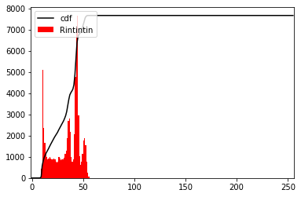
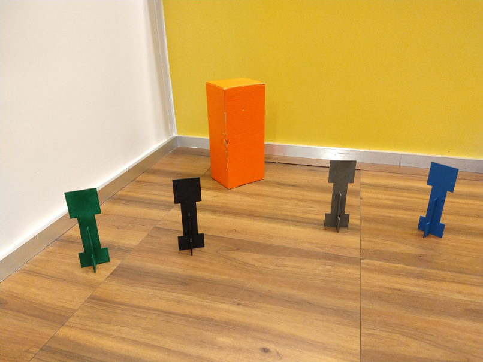
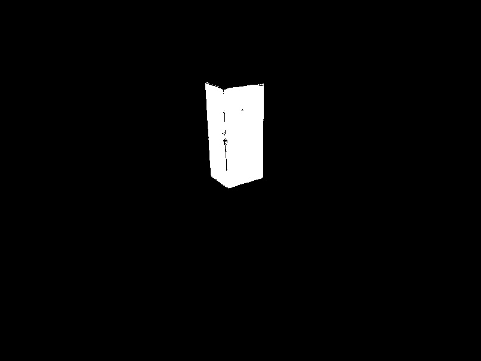
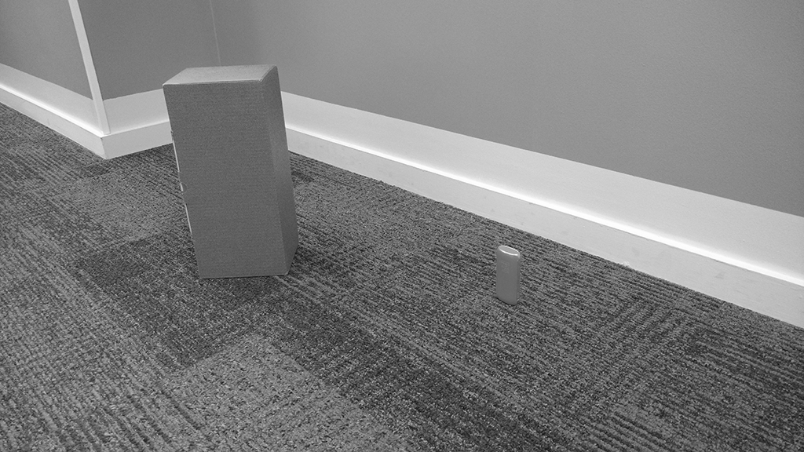

# APS01 - Imagens, formato RGB e matrizes
**Importante:** Sempre densevolvam nos arquivos `.py` dos respectivos exercícios.

**Aviso 1:** Não modifique o arquivo de teste, `test_APS01.py`.

**Aviso 2:** Lembre-se de fazer dar commit e push no seu repositório até o horário limite de entrega.

**Aviso 3:** Preencha o nome completo dos integrantes do seu grupo no arquivo `README.md` do seu repositório.

## Teste seu código

Para testar seu código, execute o  teste automatico usando o comando abaixo no terminal:

```bash
pytest
```
Caso aparece um erro de `ModuleNotFoundError`, execute o comando abaixo no terminal:

```bash
pip install pytest
```

Se discordar do resultado do teste, verifique se seu código está seguindo o que foi pedido, leia com atenção o enunciado e a saída do teste. Se ainda assim discordar, entre em contato com os professores ou outro membro da equipe da disciplina.

Alguns exercícios possuem um resultado esperado que você pode usar para conferir o seu resultado.

## Exercício 01 (Entrega obrigatória)

Observe a imagem original e seu histograma. Aprendemos que os valores dos pixels de uma imagem estão entre `0` e `255`, mas, analisando o histograma, vemos que a maioria dos pixels estão concentrados entre `~10` e `~60`. Isso significa que a imagem não está usando bem a faixa dinâmica disponível.




Neste exercício você vai "equalizar" a imagem para que ela use melhor a faixa dinâmica disponível. Antes de começar, o que você acha que vai acontecer com a imagem?

Desenvolva na função `equaliza` do arquivo [ex1.py](./ex1.py) do repositório da APS 01.
Neste momento **não utilize** bibliotecas como OpenCV para realizar o exercicio.

### Resultado Esperado
<p>
<details>
<summary>Spoiler</summary>


</details>
</p>

## Exercício 02 (Entrega obrigatória)
Neste exercício vamos trabalhar com a imagem [ex2.jpg](img/ex2.jpg). No arquivo [ex2.py](ex2.py) seu objetivo neste exercício é fazer a máscara da caixa vermelha, ou seja, criar uma imagem em que somente os pixels da caixa vermelha estão brancos e o restante preto.



Retorne ao que foi feito na `Atividade 4` para relembrar como fazer a máscara da caixa vermelha.

**DICA:** Na `Atividade 4` troque a imagem que está sendo aberta para [ex2.jpg](img/ex2.jpg), dessa forma você vai conseguir ver a imagem e o histograma de cada canal.

### Resultado Esperado
<p>
<details>
<summary>Spoiler</summary>



</details>
</p>

## Exercício 03 (Entrega obrigatória)
O leopardo das neves é um animal que se camufla muito bem em terreno pedregoso e seco. A imagem a seguir mostra este animal. Você consegue encontrá-lo?

.

Para nos ajudar a localizá-lo foram pintados na imagem dois quadrados de 3x3, um azul e um vermelho.

Neste exercicio, trabalhando no arquivo [ex3.py](./ex3.py) você deve fazer o seguinte:

* Usando código **encontrar** a posição do quadrado vermelho e do quadrado azul;

* **Recortar** a imagem usando os cantos definidos pelo quadrado vermelho e azul;

* **Salvar** o recorte em um arquivo chamado `leopard_recortado.png`. No OpenCV, para salvar uma imagem em um arquivo usamos a função `cv2.imwrite(nome_do_arquivo, imagem)`.

### Resultado Esperado
<p>
<details>
<summary>Spoiler</summary>


</details>
</p>

## Exercício 04 (Entrega obrigatória)
A imagem fornecida contém a bandeira da Antártida e a do Canadá.


No arquivo [ex4.py](ex4.py) faça o seguinte: 
* Usando código, descobrir onde começa e termina a bandeira da Antártida (`antartida`);
* Recortar a sub imagem que é a bandeira da Antártida (`antartida`);
* Descobrir onde começa e termina a bandeira do Canadá (`canada`);
* Recortar a sub imagem que é a bandeira do Canadá (`canada`);
* A função `run` deve chamar ambas as funções e salvar as imagens recortadas em arquivos chamados `antartida.png` e `canada.png`.
* Por fim, a função `run` deve mostrar as imagens recortadas em telas separadas.

**Dica:** Verifique nos outros exercícios como salvar uma imagem em arquivo e como mostrar uma imagem em uma tela.

### Resultado Esperado
<p>
<details>
<summary>Spoiler</summary>

 

</details>
</p>

## Exercício 05

Dada a imagem abaixo.



No arquivo [ex5.py](ex5.py) faça o seguinte:
* Converta a imagem para tons de cinza (de `0` a `255`);
* Para cada pixel da imagem, calcule o módulo da subtração entre o pixel que vem depois e o que vem antes dele (na horizontal);
* Retorne a imagem resultante.

**Aviso 1:** Na linha ou coluna de índice `0` não existe pixel anterior.

**Aviso 2:** Na última linha ou coluna não existe pixel posterior.

**Aviso 3:** Cuidado para não saturar os pixels, ou seja, não deixe que o valor de um pixel seja maior que `255` ou menor que `0`.

### Resultado Esperado
<p>
<details>
<summary>Spoiler</summary>


</details>
</p>

## Exercício 06
Dada a imagem abaixo.

Obs: A imagem foi ampliada para facilitar a visualização.


No arquivo [ex6.py](ex6.py), faça o seguinte:

* Onde houver um padrão parecido com um X este padrão deve ser apagado por um quadrado com valores de pixel 127.
* Retorne a imagem resultante.

### Resultado Esperado
<p>
<details>
<summary>Spoiler</summary>


</details>
</p>